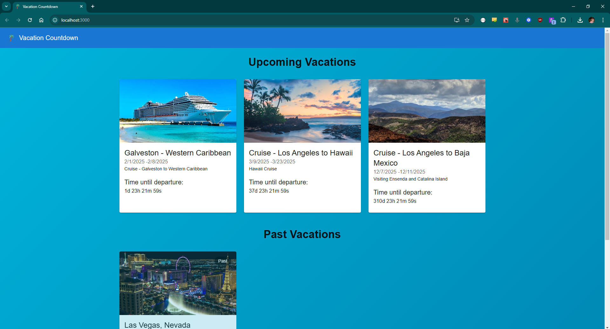

# Vacation Tracker

A modern web application for managing and tracking your upcoming and past vacations. Built with React, Material-UI, and powered by a Node.js backend.

## 🌟 Features

- Track upcoming and past vacations
- Integration with popular booking platforms:
  - Carnival Cruise Lines
  - Southwest Airlines
  - Hyatt Hotels
- Responsive design for all devices
- Beautiful animations and transitions
- Easy vacation management

## 🚀 Getting Started

### Prerequisites

- Node.js (v14 or higher)
- npm or yarn
- MongoDB (for database)

### Installation

1. Clone the repository


2. Install dependencies for both frontend and backend 
```npm run install-all```

### Run the application
```npm run start```

The application will be available at `http://localhost:3000`

## 🛠️ Built With

- [React](https://reactjs.org/) - Frontend framework
- [Material-UI](https://mui.com/) - UI component library
- [Node.js](https://nodejs.org/) - Backend runtime
- [Express](https://expressjs.com/) - Backend framework

## 📱 Screenshots

<details>
<summary>Click to view screenshots</summary>




</details>


## 📜 License

This project is licensed under the MIT License

## 👏 Acknowledgments

- Icons provided by [Material Icons](https://material.io/resources/icons/)

---

Made with ❤️ by Chase Vandiver